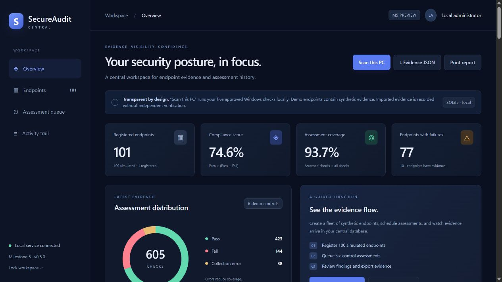

# SecureAudit

## Milestone 5 — SecureAudit Central 0.5.0

The new central backend reuses the existing scanner and scoring engine. It adds FastAPI, PostgreSQL support, a standalone SQLite mode, a browser dashboard, endpoint inventory, timestamped evidence history, SHA-256 hashes, CSV/JSON export, and a persistent demo assessment queue.

The original desktop application below remains available through `app.py`. The new entry point is `launcher.py`.

**Windows release:** extract the complete `SecureAudit-M5-Windows.zip` folder and double-click `SecureAudit-M5\SecureAuditCentral.exe`. Keep all files together. The portable distribution includes an unmodified Python Software Foundation signed interpreter; SecureAudit source itself is not code-signed. No Python installation is required. Windows Application Control blocked the unsigned PyInstaller one-file build on this development machine, so the verified release uses the portable folder.

**Demo:** Create demo fleet → Assess demo fleet → Overview → inspect endpoint evidence → export JSON/CSV. Demo endpoints are synthetic fixtures; they are never represented as real devices. **Scan this PC** runs the five existing approved PowerShell modules against the current computer. Run the executable as Administrator when privileged checks are required.

See [M5 setup and demonstration](docs/M5_CENTRAL.md) for PostgreSQL configuration, architecture, build instructions, test evidence, and scope limits. Multi-user RBAC, remote agents, policy ingestion, and AI governance remain later milestones.



SecureAudit is a local Windows technical compliance-assessment tool that runs a predefined set of approved PowerShell checks, collects structured evidence, calculates an assessment score and coverage, stores scan history in SQLite, and generates local HTML reports.

SecureAudit V1 is designed as a **standalone Windows desktop MVP**. It performs automated point-in-time technical configuration assessments for selected Windows baseline checks. It does **not** certify complete compliance with CIS Controls, CIS Benchmarks, ISO 27001, NIST CSF, or any other framework.

## Current MVP Capabilities

- Standalone Windows `SecureAudit.exe`
- Windows UAC administrator elevation
- Tkinter desktop interface
- Catalog-driven approved checklist
- Five initial Windows checks:
  - `WIN-FW-001` — Windows Firewall
  - `WIN-DEF-001` — Microsoft Defender
  - `WIN-BL-001` — BitLocker
  - `WIN-GUEST-001` — Built-in Guest account
  - `WIN-SMB1-001` — SMBv1
- Allow-listed PowerShell execution
- Structured JSON result contract
- `Pass`, `Fail`, and `Error` result model
- Compliance score and assessment coverage
- SQLite scan history
- Standalone HTML reports
- PyInstaller one-file packaging
- Persistent packaged data under `%LOCALAPPDATA%\SecureAudit`
- 89 automated tests passing on the development machine

## Application Workflow

```text
Launch SecureAudit.exe
        ↓
Windows UAC elevation
        ↓
Tkinter GUI
        ↓
Load approved catalog
        ↓
Administrator selects checks
        ↓
Run only allow-listed PowerShell modules
        ↓
Collect structured JSON evidence
        ↓
Normalize Pass / Fail / Error
        ↓
Calculate score + coverage
        ↓
Store scan in SQLite
        ↓
Generate HTML report
```

## Security Model

SecureAudit does not accept arbitrary PowerShell commands or arbitrary script paths.

Allowed:

```text
User selects WIN-FW-001
        ↓
Trusted catalog resolves firewall.ps1
        ↓
Scanner validates approved path
        ↓
Approved script executes
```

Disallowed:

```text
User enters arbitrary PowerShell
        ↓
Application executes it as Administrator
```

The scanner also enforces path-containment checks, `.ps1` restrictions, timeouts, JSON parsing, check-ID validation, and controlled error handling.

## Result Semantics

| Status | Meaning |
|---|---|
| `Pass` | The check completed and the observed state met the expected condition. |
| `Fail` | The check completed and the observed state did not meet the expected condition. |
| `Error` | A reliable assessment could not be completed. |

`Error` is deliberately not treated as `Fail`.

## Scoring

```text
Assessed checks = Passed + Failed

Compliance score =
Passed / Assessed × 100

Assessment coverage =
Assessed / Selected × 100
```

Errored checks reduce coverage but are excluded from the compliance-score denominator.

## Running From Source

Requirements:

- Windows
- Python 3.11+
- PowerShell
- project virtual environment

Example:

```powershell
cd "C:\Users\wale1\Projects\SecureAudit"
.\.venv\Scripts\Activate.ps1
python .\app.py
```

SecureAudit will request Windows administrator elevation when required.

## Running Automated Tests

```powershell
python -m pytest -v
```

Latest verified development-machine result:

```text
89 passed
```

A recurring Windows pytest temporary-directory cleanup warning may appear after the successful result. It occurs during pytest exit cleanup and has not invalidated the completed test suite.

## Building the Windows Executable

```powershell
.\build.bat
```

Output:

```text
dist\SecureAudit.exe
```

The build uses the tracked `SecureAudit.spec` file and PyInstaller.

Packaged resources:

```text
checks\catalog.json
checks\powershell\firewall.ps1
checks\powershell\defender.ps1
checks\powershell\bitlocker.ps1
checks\powershell\guest_account.ps1
checks\powershell\smbv1.ps1
```

Generated `build/` and `dist/` artifacts are not committed.

## Packaged Runtime Storage

When running from source:

```text
data\secureaudit.db
reports\
```

When running as the packaged executable:

```text
%LOCALAPPDATA%\SecureAudit\data\secureaudit.db
%LOCALAPPDATA%\SecureAudit\reports\
```

Bundled scanner resources remain separate from writable evidence storage.

## Documentation

Detailed project documentation is available under [`docs/`](docs/):

- [Architecture](docs/ARCHITECTURE.md)
- [Scanner Design](docs/SCANNER_DESIGN.md)
- [Scoring Model](docs/SCORING_MODEL.md)
- [Database and Evidence](docs/DATABASE_AND_EVIDENCE.md)
- [Security Model](docs/SECURITY_MODEL.md)
- [GRC Control Mapping](docs/GRC_CONTROL_MAPPING.md)
- [Build EXE Guide](docs/BUILD_EXE_GUIDE.md)
- [VM Testing Guide](docs/VM_TESTING_GUIDE.md)
- [Git Workflow](docs/GIT_WORKFLOW.md)
- [Project Walkthrough](docs/PROJECT_WALKTHROUGH.md)

## Current Limitations

SecureAudit V1 currently does not provide:

- centralized multi-endpoint orchestration
- remote agent management
- code signing
- MSI installer
- enterprise authentication or RBAC
- continuous monitoring
- complete CIS Benchmark coverage
- complete CIS Controls validation
- ISO 27001 certification assessment
- NIST CSF compliance certification
- tamper-proof evidence storage

Clean Windows VM portability testing is planned but was deferred during the current MVP completion cycle.

## Project Status

The local Windows MVP pipeline is complete on the development machine:

```text
Select → Scan → Collect → Assess → Score → Store → Report
```

The next major architectural phase is a future centralized version using reusable core logic behind FastAPI and endpoint agents.
